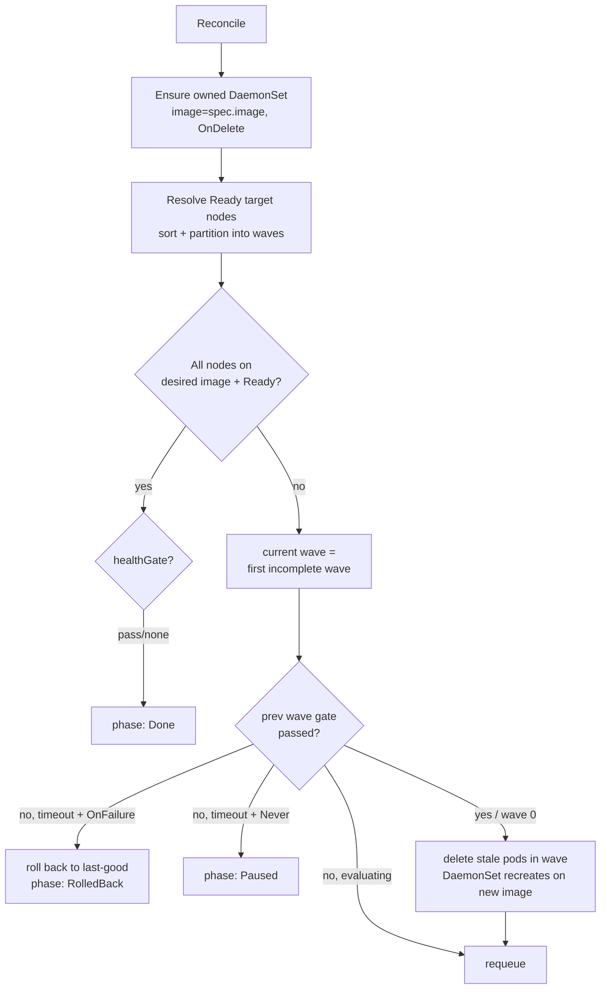

# FleetRollout

A Kubernetes operator for **progressive (wave-by-wave) rollouts to edge/fleet nodes**, with **health-gated promotion** and **automatic rollback**.

> ⚠️ Early stage / work in progress. Built as an open, generic exploration of fleet deployment safety — not tied to any product.

## Why

Kubernetes' built-in `Deployment` rollout assumes a datacenter: homogeneous nodes, stable networking, and cheap rollbacks. **Edge and robot/IoT fleets break those assumptions** — intermittent connectivity, heterogeneous hardware, and "if a node dies in the field, a human has to physically go to it." That makes *staged rollout + health gates + automatic rollback* essential, yet there's no thin, standard building block for it.

FleetRollout is a small controller that fills that gap.

## What it does

- **Wave-by-wave rollout** — update the fleet in controlled increments (`waveSize` as a count or percentage) instead of all at once.
- **Scheduling-gated waves** — pods are born with a pod `schedulingGate`; the controller ungates them per wave, so even the *first* deploy and nodes that join mid-rollout can't skip the waves or the health gate.
- **Health-gated promotion** — advance to the next wave only when an optional PromQL health check passes.
- **Automatic rollback** — on wave failure, roll back per `rollbackPolicy`.
- **Real workloads** — roll a full `spec.template` (`PodTemplateSpec`: env, volumes, resources, securityContext, sidecars, …), or use `spec.image` as shorthand for a single-container agent. Any template field change triggers a rollout.
- **Node targeting** — select the fleet by label (`targetSelector`).

## Example

```yaml
apiVersion: fleet.fleetrollout.io/v1alpha1
kind: FleetRollout
metadata:
  name: camera-agent
spec:
  targetSelector:
    matchLabels:
      fleet-group: field-robots
  image: registry.example.com/camera-agent:v2.3.0
  waveSize: "20%"
  rollbackPolicy: OnFailure
  healthGate:
    prometheusURL: http://prometheus.monitoring:9090
    query: 'min(up{job="camera-agent"}) == 1'
    timeoutSeconds: 300
```

```
$ kubectl get fleetrollout
NAME           PHASE         WAVE   UPDATED   AGE
camera-agent   Progressing   2      18        4m
```

## How it works

The controller owns a single DaemonSet with `updateStrategy: OnDelete`, so updating its
template restarts nothing. Every DaemonSet pod is born with a `schedulingGate`; the controller
advances a wave by **ungating that wave's pods** (and deleting any left on an old template hash,
which the DaemonSet recreates gated on the new one). Progress is *derived every reconcile* from
each pod's template-hash label + scheduled + readiness (level-based, restart-safe) — never
remembered. See [docs/reconcile-design.md](docs/reconcile-design.md) for the full design and trade-offs.



## Roadmap

- [x] `FleetRollout` CRD + scaffold
- [x] MVP reconcile: wave partitioning + readiness-based promotion (level-based, `OnDelete`)
- [x] PromQL health gate (gated wave promotion) + automatic rollback (`OnFailure` → last-good)
- [x] Node watch, unit tests, kind e2e, Helm chart
- [ ] Offline-node re-join convergence; envtest; richer gates (thresholds, multi-query)

## Try it locally (kind)

```sh
kind create cluster --config hack/kind.yaml           # control-plane + 4 workers
kubectl label nodes -l '!node-role.kubernetes.io/control-plane' fleet-group=field-robots
make install && make run                               # CRDs + run controller locally
kubectl apply -f config/samples/                       # a sample FleetRollout
kubectl get fleetrollout -w
```

Install via Helm (generated chart):

```sh
helm install fleetrollout ./dist/chart
```

Requires Go 1.24+, `kubebuilder`, `kind`, and `helm`.

## Demo (real output)

Upgrading a 4-node fleet with `waveSize: "25%"` and a health gate — rolls one wave at a time,
and on a failing gate rolls back to the last-good image:

```
# healthy gate: promotes wave-by-wave to Done (4 gate passes)
$ kubectl get fleetrollout rb-demo
NAME      PHASE   WAVE   UPDATED
rb-demo   Done    4      4

# failing gate + rollbackPolicy: OnFailure → reverts to last-good, phase RolledBack
$ kubectl get fleetrollout rb-demo -o jsonpath='{.status.phase}'
RolledBack
```

## License

Apache-2.0 — see [LICENSE](LICENSE).
